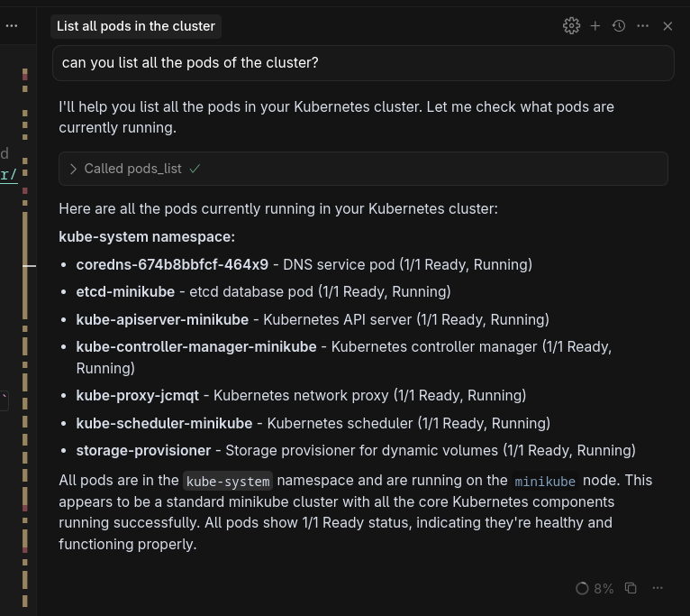

# MCP Playground


In this repository, I will be exploring the Model Context Protocol (MCP) for Kubernetes [kubernetes-mcp-server](https://github.com/containers/kubernetes-mcp-server) and how it can be used to build a chatbot.

## Concepts that I didn't know how to use

### MCP

MCP is a protocol for building AI agents that can interact with Kubernetes. It is a way to standardize the way that AI agents interact with Kubernetes, making it easier to build and deploy AI agents that can interact with Kubernetes.

### MCP Server

The MCP server is a tool that allows you to interact with Kubernetes using the MCP protocol. It is a way to standardize the way that AI agents interact with Kubernetes, making it easier to build and deploy AI agents that can interact with Kubernetes.


## Architecture

I want to use the MCP server to build a chatbot that can interact with Kubernetes. For that purpose, we will use the following tools: 

- [minikube](https://minikube.sigs.k8s.io/docs/start/) to run a local Kubernetes cluster.
- [kubectl-mcp-server](https://github.com/containers/kubernetes-mcp-server) to run the MCP server.
- [Gradio](https://gradio.app/) to build the chatbot interface.
- [Cursor editor](https://www.cursor.com/) to test the capabilities of the MCP server.


## Set Up the minimal demo

1. Install minikube

```bash
curl -LO https://github.com/kubernetes/minikube/releases/latest/download/minikube-linux-amd64
sudo install minikube-linux-amd64 /usr/local/bin/minikube && rm minikube-linux-amd64
```

2. Start minikube

```bash
minikube start
```

Manage the cluster with the following commands:

```bash
# Check the status of your cluster
minikube status

# Pause Kubernetes without impacting deployed applications
minikube pause

# Unpause a paused instance
minikube unpause

# Halt the cluster
minikube stop

# Delete the cluster
minikube delete

# Memory used
minikube ssh "free -hm"

# Get the IP address of the cluster
minikube ip
```


3. Interact with the Kubernetes cluster

```bash
kubectl get pods -A
```


4. Enable Ingress on minikube

```bash
minikube addons enable ingress
```

> **Note:**  
> You can test the ingress functionality in your minikube cluster by following the procedure described in the [official Kubernetes documentation](https://kubernetes.io/docs/tasks/access-application-cluster/ingress-minikube/#deploy-a-hello-world-app), which walks you through deploying a hello-world app and verifying ingress is working as expected.


5. Install kubectl-mcp-server accessing this [link](https://github.com/containers/kubernetes-mcp-server?tab=readme-ov-file#cursor) and selecting your preferred editor.

>
> **Recommendation:**  
> The default configuration in the official documentation does not include the `--disable-destructive` flag. To ensure your cluster remains safe while you practice, I recommend installing and configuring the MCP server by editing your Cursor configuration file (usually located at `~/.cursor/mcp.json`) as follows:
>
> ```json
> {
>   "mcpServers": {
>     "kubernetes-mcp-server": {
>       "command": "npx",
>       "args": ["-y", "kubernetes-mcp-server@latest", "--disable-destructive"]
>     }
>   }
> }
> ```
> 
> This setup will start the MCP server with the `--disable-destructive` flag enabled by default. This ensures that the chatbot and MCP server will not perform any destructive operations on your Kubernetes cluster.


This is an example of how to list all pods using Cursor and MCP server:




## Build the chatbot

With the previous steps, we have a Kubernetes cluster running in our local machine. Now, let's add a simple chatbot frontend that will be used to interact with the Kubernetes cluster.


