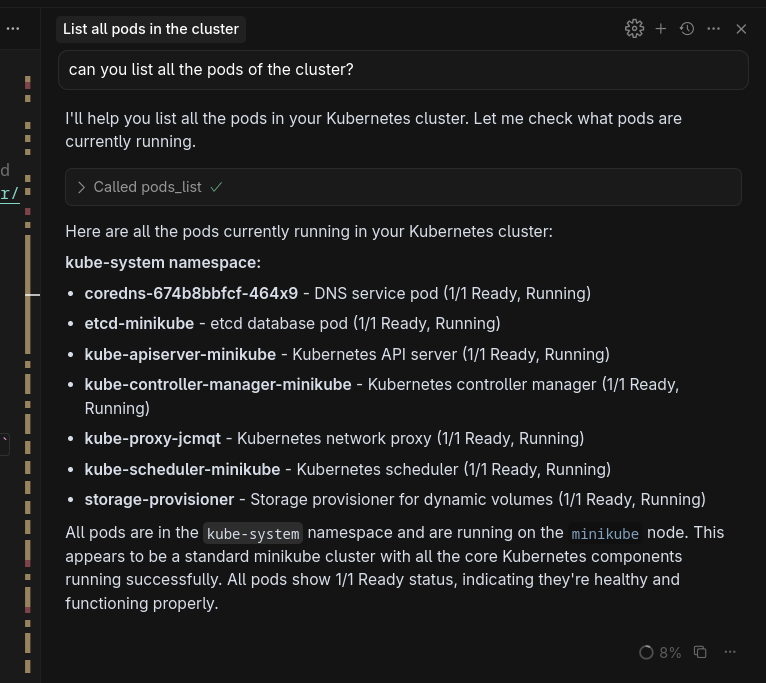

# 🚀 Local Development with Cursor

This section covers setting up MCP locally in Cursor and interacting with the locally deployed Kubernetes cluster.

## Overview

Learn how to set up a local Kubernetes environment with minikube, install the MCP server in Cursor, and test the integration between AI tools and your local Kubernetes cluster.

## Prerequisites

- [minikube](https://minikube.sigs.k8s.io/docs/start/) for local Kubernetes cluster
- [kubectl](https://kubernetes.io/docs/tasks/tools/) for cluster management
- [Cursor Editor](https://www.cursor.com/) for MCP integration testing
- [Node.js](https://nodejs.org/) (for npx commands)
- [Docker](https://docs.docker.com/get-docker/) or [Podman](https://podman.io/) (for container runtime)

## Step-by-Step Setup

### 1. Install minikube

Install minikube to create a local single-node Kubernetes cluster for development and testing.

```bash
curl -LO https://github.com/kubernetes/minikube/releases/latest/download/minikube-linux-amd64
sudo install minikube-linux-amd64 /usr/local/bin/minikube && rm minikube-linux-amd64
```

### 2. Start minikube

```bash
# Start a new minikube cluster with default settings
minikube start

# Optional: Start with specific resources
# minikube start --cpus=2 --memory=4096 --disk-size=20g
```

Manage the cluster with the following useful commands:

```bash
# Check the status of your cluster
minikube status

# Pause Kubernetes without impacting deployed applications
minikube pause

# Unpause a paused instance
minikube unpause

# Halt the cluster
minikube stop

# Delete the cluster
minikube delete

# Memory used
minikube ssh "free -hm"

# Get the IP address of the cluster
minikube ip
```

### 3. Interact with the Kubernetes cluster

```bash
# List all pods across all namespaces to verify cluster is working
kubectl get pods -A
```

### 4. Enable Ingress on minikube

Enable the Ingress addon to test HTTP routing and load balancing in your local cluster.

```bash
minikube addons enable ingress
```

> **Note:**  
> You can test the ingress functionality in your minikube cluster by following the procedure described in the [official Kubernetes documentation](https://kubernetes.io/docs/tasks/access-application-cluster/ingress-minikube/#deploy-a-hello-world-app), which walks you through deploying a hello-world app and verifying ingress is working as expected.

### 5. Install kubectl-mcp-server

Install the Kubernetes MCP server to enable AI tools to interact with your cluster. Access this [link](https://github.com/containers/kubernetes-mcp-server?tab=readme-ov-file#cursor) and select your preferred editor.

> **Security Recommendation:**  
> The default configuration in the official documentation does not include the `--disable-destructive` flag. To ensure your cluster remains safe while you practice, I recommend configuring the MCP server with the `--disable-destructive` flag by editing your Cursor configuration file (usually located at `~/.cursor/mcp.json`) as follows:
>
> ```json
> {
>   "mcpServers": {
>     "kubernetes-mcp-server": {
>       "command": "npx",
>       "args": ["-y", "kubernetes-mcp-server@latest", "--disable-destructive"]
>     }
>   }
> }
> ```
> 
> This setup will start the MCP server with the `--disable-destructive` flag enabled by default. This ensures that the chatbot and MCP server will not perform any destructive operations on your Kubernetes cluster.

## Testing MCP Integration

Once configured, you can test the MCP integration by asking Cursor to interact with your Kubernetes cluster. Here's an example of how to list all pods using Cursor and the MCP server:



## Next Steps

Now that you have MCP working locally with minikube, you're ready to deploy it to a production Kubernetes cluster.

Continue to ☸️ [Deploy MCP Server on OpenShift](02-deploy-mcp-openshift.md) section ➡️
