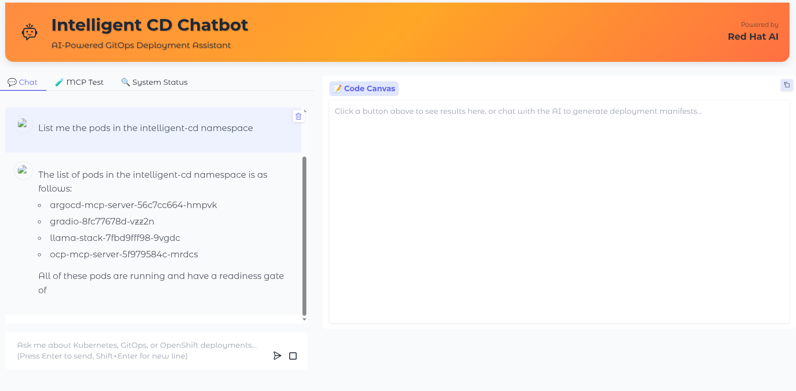
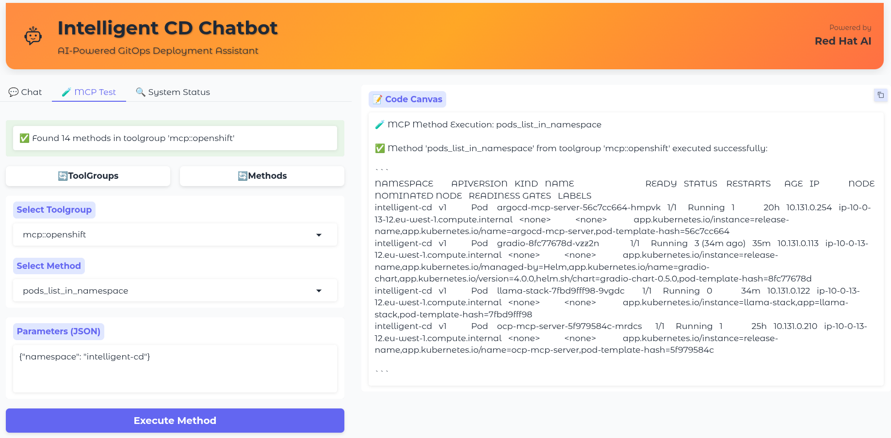
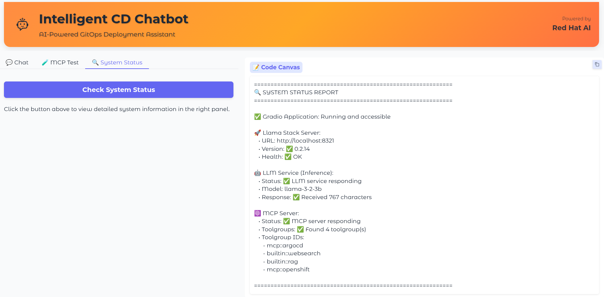

# 🌐 Deploy Gradio Interface on OpenShift

## Overview

Learn how to deploy a Gradio chatbot interface to OpenShift for your MCP server. This guide covers why you need a frontend, available alternatives, and how to build and deploy your custom interface.

## Why Do You Need a Frontend?

Your MCP server runs in the background, but users need a way to interact with it. A frontend provides:

- **User Interface**: Chat interface for non-technical users
- **Accessibility**: Web-based access from anywhere
- **Integration**: Connect MCP tools to user workflows
- **Customization**: Tailor the experience to your use case

## Frontend Alternatives

### Pre-built Solutions (No Coding Required)

| Option | Pros | Cons |
|--------|------|------|
| **OpenWebUI** | ✅ Ready to use, MCP support, modern UI | ⚠️ Less customizable, generic interface |
| **Chatbot UI** | ✅ Quick setup, responsive design | ⚠️ Limited MCP integration |
| **Ollama WebUI** | ✅ Simple, lightweight | ⚠️ Basic features, no MCP support |

### Custom Frameworks (Requires Development)

| Framework | Use Case | Development Effort |
|-----------|----------|-------------------|
| **Gradio** | ML/AI interfaces, rapid prototyping | 🟢 Low |
| **Streamlit** | Data apps, dashboards | 🟡 Medium |
| **Flask/FastAPI** | Full control, custom logic | 🔴 High |

## What is Gradio?

Gradio is a **Python framework** that creates web interfaces from your code. It's not a pre-built container - you need to:

1. **Write Python code** that integrates with your MCP server
2. **Define the interface** using Gradio components
3. **Package everything** into a container with dependencies
4. **Deploy** to OpenShift

### Why Build Instead of Use Pre-built?

- **Custom MCP Integration**: Tailored to your specific tools and workflows
- **Branded Experience**: Match your organization's look and feel
- **Advanced Features**: Add custom logic, validation, and business rules
- **Full Control**: Modify behavior without waiting for upstream changes


## Step 1: Prepare Your Gradio Application

### Application Structure

```
gradio-app/
├── main.py              # Main Gradio interface with MCP integration
├── requirements.txt     # Python dependencies
├── Dockerfile          # Container definition
└── .env.example        # Environment variables template
```

### Test the Gradio Application locally

```bash
LOG_LEVEL=INFO gradio gradio-app/main.py 
```

### Build the Gradio Application

```bash
podman build -t quay.io/alopezme/intelligent-cd-gradio:latest gradio-app 
```

Test the image locally:

```bash
podman run --network host quay.io/alopezme/intelligent-cd-gradio:latest
```

Push the image to the registry:

```bash
podman push quay.io/alopezme/intelligent-cd-gradio:latest
```


## Step 2: Deploy the Gradio Application

```bash
helm template gradio-chart \
--set llamaStack.url="http://llama-stack-service:8321" \
--set llamaStack.model="llama-3-2-3b" \
| oc apply -f -
```

Great! Now you can access the Gradio application at:

```bash
oc get route gradio -n intelligent-cd --template='https://{{ .spec.host }}'
```


## The Gradio Application


The application consists of 3 tabs:

1. **Chat**: A chat interface for the user to interact with the Llama Stack.
2. **MCP Test**: A tab to test MCP servers and their tools.
3. **System Status**: A tab to check the system status.


The first tab is the chat interface. It allows the user to interact with the Llama Stack.



The second tab is the MCP Test tab. It allows the user to test the MCP servers and their tools.



The third tab is the System Status tab. It allows the user to check the system status.



